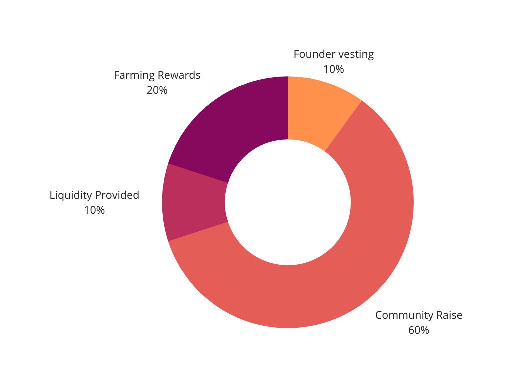

# FAQ

## Basics

### What is NFTX?

NFTX is a platform for making ERC20 tokens that are backed by NFT collectibles. These tokens are called funds, and \(like all ERC20s\) they are fungible and composable. With NFTX, it is possible to create and trade funds based on your favorite collectibles such as [CryptoPunks](https://www.larvalabs.com/cryptopunks), [Axies](https://marketplace.axieinfinity.com), [CryptoKitties](https://www.cryptokitties.co/), and [Avastars](https://avastars.io/), right from an exchange. 

NFTX's mission is to become the primary issuer of NFT index funds, allowing anyone to invest in NFT markets without needing the underlying knowledge and expertise required when investing in individual assets. By doing so, NFTX will function as a black hole for NFT assets.

### How are NFT index funds useful?

Investing in NFTs is booming. For example, Delphi Digital [invested for over 150k in _digital collectible pets_ called Axies](https://www.delphidigital.io/reports/why-we-spent-159k-on-digital-battle-pets-2/), which are the main game collectibles for the highly successful game [Axie Infinity.](https://www.axieinfinity.com)

However, there are many people, organizations, and institutions that don’t have the time or knowledge to invest in individual NFTs but would like exposure to NFT markets. These are the NFTX target users—the people investing in NFT index funds on an exchange, rather than buying specific NFTs.

Most of the time the only people minting/redeeming fund tokens will be arbitrageurs. This is similar to the dynamic with WBTC. Most people that trade WBTC do not mint and burn it themselves.

### Is NFTX fully permissionless?

Yes, NFTX contracts are fully permissionless on-chain contracts.

The NFTX.org interface is built and maintained by the NFTX DAO and will be open-sourced as soon as possible, for anyone to run locally when needed. 

### Who is working on NFTX?

NFTX is built by a decentralized autonomous organization \(DAO\) - a group of community members, contributors, and core members closely aligned to build the primary NFT index fund ecosystem. As NFTX is an open organization, anyone anywhere may join to provide expertise and/or additional resources with the goal to grow NFTXs' success. 

If you'd like to contribute to what NFTX is building, feel free to join the community [on Discord.](https://discord.gg/xcJkxMXSR8)

### Does NFTX charge any fees?

There are currently no fees charged on NFTX.   
  
In the future, charging fees on managing index funds is one of the ways the NFTX token can accrue more value. The implementation of this will be decided by NFTX token holders.

### Is there an NFTX token?

Yes. The NFTX token is a governance token that can be used to vote on proposals and steer the direction of the organization. In total 650000 NFTX tokens will ever exist.  

* 65K NFTX tokens are allocated to the founder of NFTX, Alex Gausman. These tokens are on a 5-year linear vesting schedule, without cliff. Rewards on this vesting schedule are unlocked per block and added to the circulating supply until fully distributed. 
* 390K NFTX tokens were distributed during the origin community raise, which has taken place from December 2020 to early January 2021. The tokens were granted to early community members through open bounties at various rates of ETH, as well as several NFTs. You can find a full breakdown of this event [here.](https://nftx.gitbook.io/nftx/community-raise)
* 65K NFTX tokens are supplied as liquidity by the NFTX DAO on an AMM.
* 130K NFTX tokens are held in the NFTX DAO Treasury, earmarked to use as liquidity farming rewards, which will start in Q1 or Q2 of 2021. No further details about this program are currently available.

## Miscellaneous

### Who is the target audience of NFTX?

There are three main target audiences for NFTX: Investors, arbitrageurs, and NFT liquidity providers.

The main products are built for investors looking to take a well-spread position in the NFT markets through buying into one or multiple NFT index funds. This audience most likely will not come into direct contact with the products offered on the NFTX.org website, as they will use a DEX such as Uniswap or an aggregator such as 1inch or DEX.AG to invest in the fund on the open markets. Investment products may be built for this audience later.

The second audience we cater to are arbitrageurs, who can profit from ranging prices between NFT index funds and their underlying collaterals' floor prices. Arbitrageurs can use the products on nftx.org to interact directly with the index fund pools. 

A third audience we cater to are NFT liquidity providers, who can profit from providing additional liquidity to one or multiple NFT index funds. Liquidity providers may use the products on nftx.org to mint additional NFT fund tokens, which can then be supplied as liquidity on a Balancer pool or directly on a DEX.

Next to these three main audiences, a fourth target audience would be NFT collectors who want to trade their NFT with another NFT of the same category. These collectors can do so by minting a fund token on nftx.org & redeeming that token right after, giving back a random NFT from the fund.

### What is the NFTX token address?

The address of NFTX is: 0x87d73e916d7057945c9bcd8cdd94e42a6f47f776

### How do I buy NFTX?

NFTX is available for trading on decentralized exchanges. To find the best rates across multiple exchanges, we recommend using an aggregator such as [Matcha](https://matcha.xyz/).

### Where do I find NFTX Index Funds?

While the DAO contributors are working on creating better interfaces to invest in NFT Index Funds on NFTX.org, we've built a page that provides all current information below:



